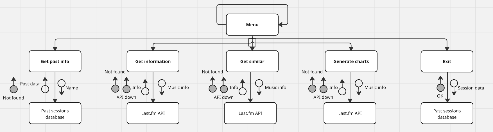
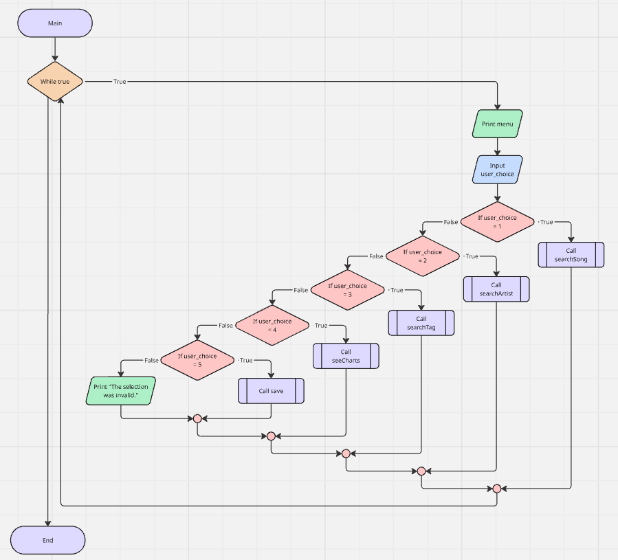
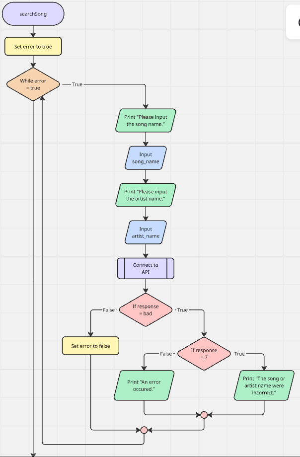
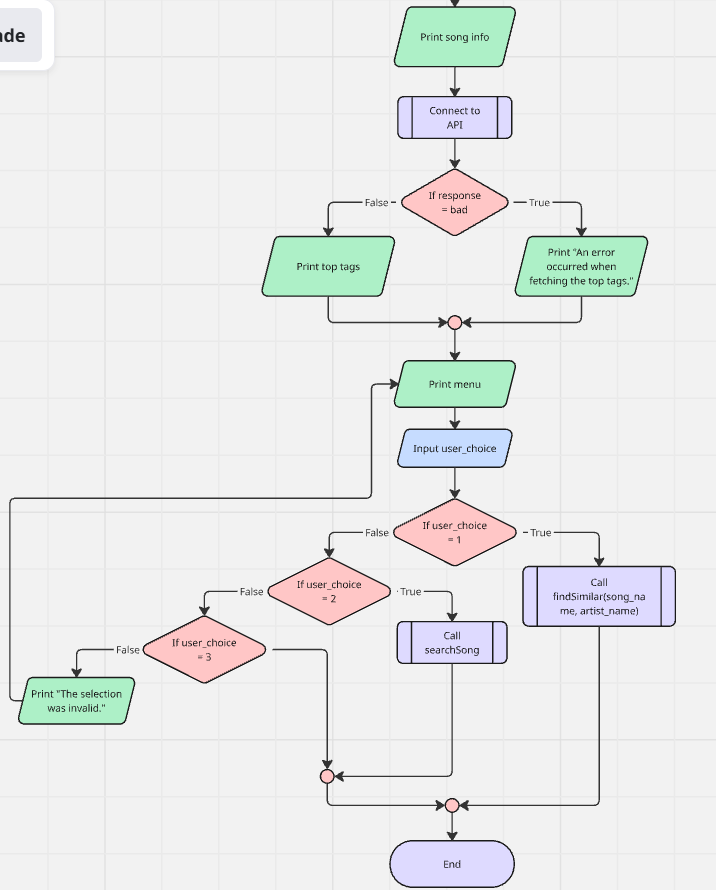
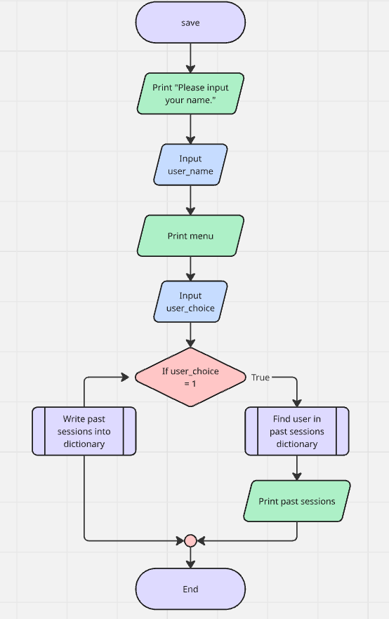

# Requirements Definition
## Purpose of the System
- The purpose of this system is to allow music listeners to get more information about songs, artists, and genres, sourced from the last.fm API.
- The target users for this program are people of all ages, and all capabilities - it should be accessible, simple, and with easily understandable information.
## Functional Requirements
- **User Requirements**
    - the user must be able to search for songs, artists, and albums
    - the user must be able to input which information they'd like to know (similar tracks, charts, etc.)
    - the user must be able to request help
- **Inputs and Outputs**
    - the system must output accurate and well-formatted information relating to the search
    - the system must output accurate top tracks & artists when prompted
    - the system must output similar tracks, artists, or genres when prompted
    - the system must output charts using matplotlib
- **Core Features**
    - the system must allow users to input songs, tracks, and artists with decent input validation (they can access this ability through the main 'options' menu), and then output the desired data.
    - the system must record previous activity in a text file
- **User Interaction**
    - the user will interact with the system through a text-based UI, including a list of options when they first begin, which can be accessed at any point.
- **Error Handling**
    - Errors which may need to be handled include:
        - input being invalidated
        - inaccurate responses from the API
        - badly formatted responses from the API
### Use Cases
- 01: Search for information on a track
    - Actors: User
    - Preconditions: Internet access; last.fm API is available.
    1. Input the name of the track
        - User enters the name of a track (song)
        - User enters the name of the artist who made it
    2. System retrieves the information on the track from the API using `track.getInfo` and `track.getTopTags`.
    3. Information such as title, artist name, song length, and top tags is displayed
    - Postconditions: Track data is retrieved and displayed successfully.
- 02: Search for information on an artist
    - Actors: User
    - Preconditions: Internet access; last.fm API is available.
    1. Input the name of the artist
        - User enters the name of an artist
    2. System retrieves the information on the artist from the API using `artist.getInfo` and `artist.getTopTags`.
    3. Information such as artist name, top tags, and artist biography are displayed.
    - Postconditions: Artist data is retrieved and displayed successfully.
- 03: Search for information on a tag
    - Actors: User
    - Preconditions: Internet access; last.fm API is available.
    1. Input the name of the tag
        - User enters the name of a tag
    2. System retrieves the information on the tag from the API using `tag.getInfo` and `tag.getTopTracks`.
    3. Information such as a summary of the tag, its popularity, and top songs within that tag are displayed.
    - Postconditions: Tag data is retrieved and displayed successfully.
- 04: Search for similar tracks
    - Actors: User
    - Preconditions: Internet access; last.fm API is available; the user has been prompted to get similar tracks within the 'tracks information' use case
    1. Input the name of the track
        - User enters the name of a track
        - User enters the name of the artist who made it
    2. System retrieves the information on the track from the API using `track.getSimilar`.
    3. A short list of similar tracks is displayed.
    - Postconditions: Similar tracks are retrieved and displayed successfully.
- 05: Search for similar artists
    - Actors: User
    - Preconditions: Internet access; last.fm API is available; the user has been prompted to get similar artists within the 'artists information' use case
    1. Input the name of the artist
        - User enters the name of an artist
    2. System retrieves the information on the track from the API using `artist.getSimilar`.
    3. A short list of similar artists is displayed.
    - Postconditions: Similar artists are retrieved and displayed successfully.
- 06: Search for similar tags
    - Actors: User
    - Preconditions: Internet access; last.fm API is available; the user has been prompted to get similar artists within the 'tags information' use case
    1. Input the name of the tag
        - User enters the name of a tag
    2. System retrieves the information on the track from the API using `tag.getSimilar`.
    3. A short list of similar tags is displayed.
    - Postconditions: Similar tags are retrieved and displayed successfully.
- 07: Request charts on top tracks
    - Actors: User
    - Preconditions: Internet access; last.fm API is available
    1. System retrieves the information on the top tracks from the API using `chart.getTopTracks`.
    2. This information is converted to a bar graph using matplotlib.
    3. A chart of top tracks is displayed.
    - Postconditions: Top tracks are retrieved and displayed successfully.
- 08: Request charts on top artists
    - Actors: User
    - Preconditions: Internet access; last.fm API is available
    1. System retrieves the information on the top tracks from the API using `chart.getTopArtists`.
    2. This information is converted to a bar graph using matplotlib.
    3. A chart of top artists is displayed.
    - Postconditions: Top artists are retrieved and displayed successfully.
- 09: Request charts on top tags
    - Actors: User
    - Preconditions: Internet access; last.fm API is available
    1. System retrieves the information on the top tracks from the API using `chart.getTopTags`.
    2. This information is converted to a bar graph using matplotlib.
    3. A chart of top tags is displayed.
    - Postconditions: Top tags are retrieved and displayed successfully.


## Non-Functional Requirements
- **Performance**
    - The system must connect to the API and output relevant data in under two seconds, ideally under one (*note to self: dad's idea of the built in library should be helpful for this, rather than requests.*)
- **Usability/Accessibility**
    - The system must be accessible, simple, and easily understandable, as it's designed for users of all knowledge and capabilities.
- **Reliability**
    - The system must provide accurate information relating to tracks, artists, and genres.

## Constraints
- The system will be developed using python, likely with a word-based interface due to time constraits.
- The project must be completed within 3 weeks (as of 02.03.26). This causes quite heavy time constraints. The due date is the 27th of March, 9AM.
- Only free tools can be used.

## Success Criteria
- (sourced from the marking rubric)
- The system will be considered successful if:
    - API data is retrieved
    - Errors are handled and user inputs are validated
    - Multiple python modules are used
    - Programming is safe & secure
    - Code is well commented and there is a 'README.md' file and 'requirements.txt' file with required information.
    - Program is regularly and meaningfully committed to GitHub
    - Code is highly efficient
    - UI is intuitive and responsive
    - Requirements cover everything necessary
    - There are use cases in functional requirements
    - Developer and user requirements are detailed
    - The data dictionary is clear and accurate
    - Flowcharts and pseudocode represent the program's logic
    - Gantt chart is accurate and covers everything
    - There's an evaluation of functionality + outline of future steps
    - There's highly advanced API integration and module usage (+ evaluation)
    - Future maintenance is evaluated

# Design
## Structure Chart


## Data Dictionary
| Field name | Description | Data type | Constraints / Notes | Size for display |
| --- | --- | --- | --- | --- |
| user_choice
| song_name
| artist_name
| tag_name

## Pseudocode
**Main Routine**
```
BEGIN menu()
WHILE True:
    DISPLAY:
        "[1] Search for a song
        [2] Search for an artist
        [3] Search for a tag
        [4] See top music
        [5] Save and exit"
    INPUT user_choice
        IF user_choice = 1 THEN:
            search_song()
        IF user_choice = 2 THEN:
            search_artist()
        IF user_choice = 3 THEN:
            search_tag()
        IF user_choice = 4 THEN:
            see_charts()
        IF user_choice = 5 THEN:
            save()
        ELSE:
            DISPLAY "The choice was invalid."
        ENDIF
END
```
**Function: searchSong**
```
BEGIN searchSong()
    REPEAT
        DISPLAY "Please input the song name."
        INPUT song_name
        DISPLAY "Please input the artist name."
        INPUT artist_name
        REQUEST track.getInfo (song_name, artist_name)
        IF error = true THEN:
            IF: response = 7 THEN:
                DISPLAY "The artist or song name were incorrect."
            ELSE:
                DISPLAY "An error occured."
        ENDIF
    UNTIL error = false
    DISPLAY track.getInfo
    REQUEST track.getTags
        IF error = true THEN:
            DISPLAY "An error occured when fetching the top tags."
    DISPLAY track.getTopTags
    DISPLAY:
        "[1] Find similar songs
        [2] Search for another song
        [3] Return to menu"
    WHILE True:
        INPUT user_choice
        IF user_choice = 1 THEN:
            similar_songs(song_name, artist_name)
        IF user_choice = 2 THEN:
            search_song()
        IF user_choice = 3 THEN:
            menu()
        ELSE:
            DISPLAY "The choice was invalid."
END
```
**Function: save**
```
BEGIN save
    DISPLAY:
        "[1] View a previous session
        [2] Save this session"
    INPUT user_choice
    IF user_choice = 1 THEN:
        DISPLAY pastsessions.txt
    ELSE:
        DISPLAY "Please enter your name."
        INPUT user_name
        SAVE past_session and user_name to pastsessions.txt
END
```

## Flowcharts
**Main**

**searchSong()**


**save()**

Better resolution: https://miro.com/app/board/uXjVGxIgRu8=/?share_link_id=865733471916
